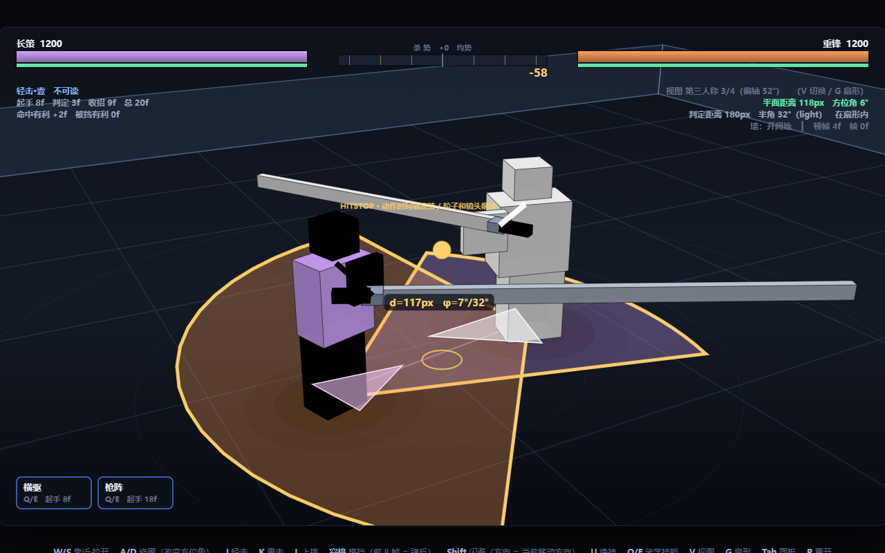
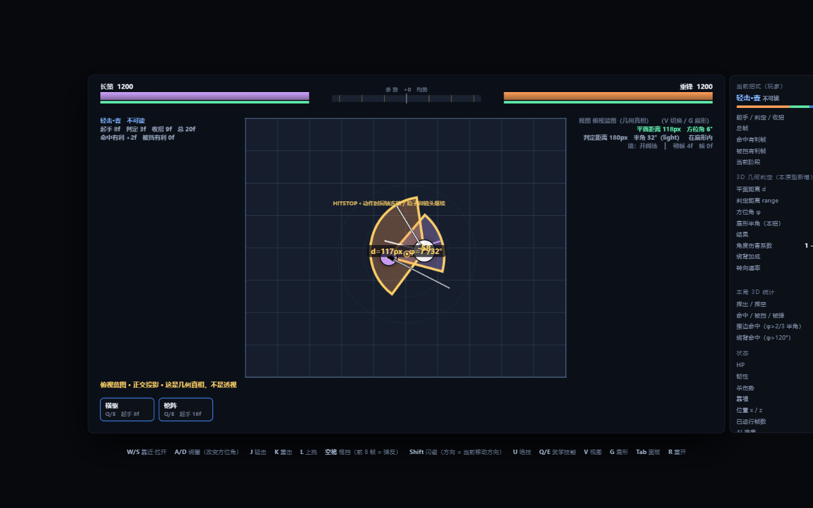
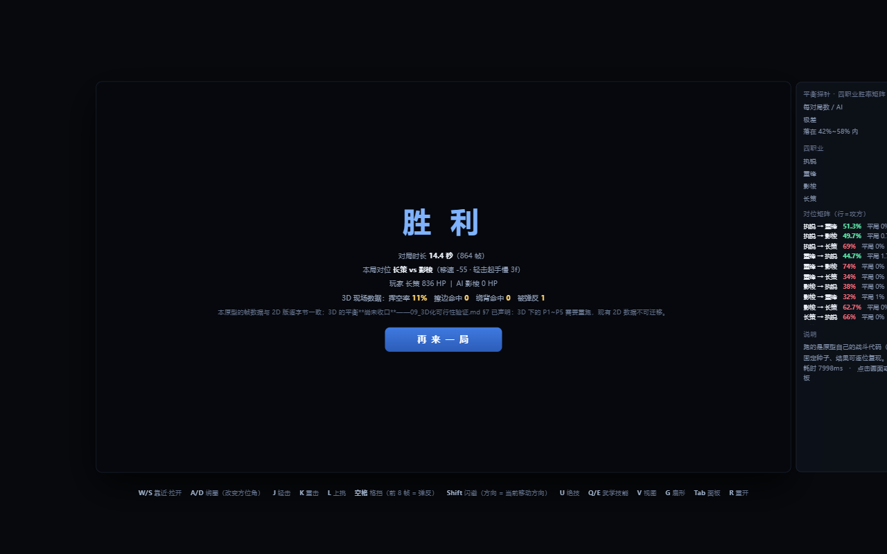

# 《止戈》3D 战斗原型 · Zhige 3D Combat Prototype

> **一次可验证的迁移实验：把 2D 的帧数据原样搬进三维空间。**
> 黄渊 · 2027 届 · 求职意向：**游戏战斗策划**
>
> 单文件、零依赖、双击即玩。**3D 版与 2D 版的帧数据逐字节一致**，被重做的只有空间维度 —— 这不是主张，是一条能跑出红绿的命令。

---

## ▶ 直接开打

### **[点这里在线试玩 →](https://yuan8863.github.io/zhige-combat-3d/)**

浏览器打开即玩，无需安装。也可以把本仓库拉下来**双击 `index.html`**（离线、无服务器、无依赖）。

| 键 | 动作 | 键 | 动作 |
|---|---|---|---|
| `W A S D` | 移动 | `空格` | 跳跃（空中 + 攻击 = **跳劈**） |
| **鼠标** | 控制面向 / 视角 | `Shift` | 闪避（第 14 帧起可取消成攻击） |
| **左键**（按住可蓄） | 轻击（连段）/ **蓄力攻击** | **右键** | 重击 |
| 按住 `F` | 格挡 / 弹反（弹反到带霸体的招式 = **振刀·兵刃脱手**） | `R` | **上挑**（唯一能打到空中的招式） |
| `Q` `E` | 武学技能 1 / 2 | `X` | 绝技 |
| `V` | 切换机位（第三人称 3/4 · 俯视蓝图 · 侧视对照） | `M` / 点击画面 | 锁定 · 自动面向 / 无锁定 · 鼠标瞄准 |
| `Y` | 辅助模式开关 | `T` | 教学提示开关 |

> **想打弹反**：不要一看到对手抬手就架格挡，要压到**判定前几帧**再按。想验证"3D 才有的东西"，
> 按 `V` 切到**俯视蓝图**——那是正交投影的几何真相视图，扇形判定范围会直接画在地面上。





---

## 一、这份材料想证明的一件事

"把游戏从 2D 改成 3D"在作品集里通常是一句话。但它其实是一个可以被证伪的命题：

> **战斗系统的机制层，到底有多少是维度相关的？**

我的判断是：**机制层几乎不依赖维度，需要重建的只有"决策几何"与"表现层"。**
我没有把这句话写成结论，而是**做了一份能跑的原型去证伪它** —— 然后它被推翻了三次（见第三节）。

**验证方式不是"看起来像"，而是一条命令** —— `tools/cross3d_check.py` 把两个版本的数据块
逐字节比对：只要有一个数字、一个注释、一个空格被改动，它就失败。

### 本机实测输出（可复跑）

```text
✅ 数据块逐字节一致（11652 字符 / 238 行）
✅ 数据块内数值字面量：319 个（全部参与逐字节比对）
✅ 数据块覆盖四张表与全部常量（10 项关键符号）
✅ 3D 专属内容（GEO / 相机 / 渲染参数）全部落在数据块之外
✅ 两版都是零依赖单文件页面（各 1 个 script 块，直接双击可运行）
```

---

## 二、3D 到底改了什么

| 层 | 内容 | 处置 |
|---|---|---|
| **帧数据表** | 起手 / 判定 / 收招、有利帧、取消窗口 | **原样保留**（逐字节证明） |
| **伤害与削韧** | 职业倍率、连段递减、贴身惩罚、霸体 | **原样保留** |
| **资源系统** | 韧性 / 破防 / 架崩 / 处决 / 杀势 / 困兽之斗 | **原样保留** |
| 距离判定 | `\|x_def − x_atk\| ≤ range`（一条轴上的一个数） | 平面距离 `√(dx²+dz²)` |
| 攻击范围 | 一维线段 | **地面扇形**：半角随「招式方向 × 职业武器」变化（32°~68°） |
| 朝向 | `facing = ±1`，每帧硬设 | `yaw` + **限速转向**（空闲 6°/帧、出招 0.7°/帧） |
| 墙面 | 左右两道线 | 矩形竞技场：**法向被吸收、切向滑走**，并有墙角分级 |
| 伤害 | 固定值 | 基础值 **× 角度衰减**（正对 ×1.00 / 扇形边缘 ×0.66） |
| 新增玩法 | —— | 绕背 / 侧击、任意方位闪避、跳劈、防空上挑、墙面几何 |

**"判定从布尔量变成连续量"是这次迁移里最容易被忽略、也最容易做坏的一步。**
一味强化判定会变成"擦到就算中"，一味收紧就会让玩家觉得"我明明对准了却没中"——
所以让角度衰减系数来承接这份不公平感（正对 ×1.00 / 边缘 ×0.66），并把扇形范围直接画在地面上。

---

## 三、三个被实测推翻的假设

这一节是我最想让人看到的部分。三个假设都不是凭空想的，都是"照着 2D 经验推过去"的合理判断。

| 我原本以为 | 实测发现 | 现在的做法 |
|---|---|---|
| 把渲染换成 3D 就行，逻辑可以照搬 | **纯第三人称跟背机位在近战原型里完全不可读**：交战轴与视轴重合，对手被自己挡在正后方，两人在屏幕上的水平间距是 **0px** | 改成"绕交战轴偏 **52°** 的 3/4 机位"（间距 **302px**），机位做成可切换三档 |
| 命中判定从 1 条不等式变成 3 条就够了 | 判定从**布尔量**变成**连续量**后，玩家会得到"我明明对准了却没中"的不公平感 | 用角度衰减系数承接，并用一圈琥珀亮边把"这一刀能不能打到"画在**地面上** |
| 2D 的"出招即承诺帧数"可以原样保留 | 3D 多出了**第二条承诺：朝向**。而朝向的代价必须有上限，否则"绕背"这个新玩法根本不成立 | 引入限速转向，并用它反推出**"可绕背半径"表** |

**可绕背半径（这是"绕背能不能成立"的量化边界，解析预测 vs 原型实测）**

| 对位 | 解析预测 | **实测** | 结论 |
|---|---|---|---|
| 影梭 → 重锋 | 97px | **85px** | ✅ 快职业绕得动重锋 |
| 执锐 → 重锋 | 85px | **75px** | ✅ |
| 长策 → 重锋 | 81px | **70px** | ✅ |
| **重锋 → 影梭** | 51px | **45px** | ❌ 低于身体间距 56px = **实际绕不动** |

解析式系统性地高估 **9%~20%（平均 13.3%）** —— 因为它只考虑"守方跟不跟得上"，
而实际还要满足"攻方自己也转得过来"。**快职业绕得动、重锋绕不动**，正好是设计想要的结果。

---

## 四、十二轮迭代：每一轮都是被数据推着走的

原型不是一次写完的。它迭代了 12 轮，**每一轮都有可复跑的读数**——包括被数据否掉的那些。

| 轮次 | 做了什么 | 关键读数 |
|---|---|---|
| 1 | 3D 化迁移本体：相机 / 判定 / 朝向 / 墙面 / 伤害衰减 | 三个假设被推翻（第三节） |
| 2 | 把崩掉的平衡拉回来：攻击范围拆成**长度 × 角度**两条轴 | 极差 **54.5pp → 9.9~10.3pp**；顺带修掉"AI 60 秒只出 7 刀"的 bug |
| 3 | 输入层：鼠标面向 + **受限追踪** + 打开高度轴 + 闪避后反击 | 空挥率 **17.5% → 14.8%** |
| 4 | 动作四原则（预备/跟随/**重叠**/弧形）+ 17 关节部件 + 攻击预警 + 辅助模式 | 普通档极差 **→ 5.7pp** |
| 5 | 把"动作僵硬"变成数字（动作质量审计） | 姿态跳变比 **11.6 → 4.84**，jerk 峰值 **3.116 → 1.983** |
| 6 | 第一次把 3D 的反制矩阵测出来 | 抓到**污染了全部历史数据的 bug**（探针里玩家侧被 AI 驱动时格挡误读 `isPlayer`） |
| 7 | 反制矩阵修复 | **3/6 → 5/6**；拒绝了一个"用纪律换数字"的改动 |
| 8 | 受击分级 + 顿帧按武器重量分档 + 跳劈 + 防空上挑 | 最差对位 **14.7% → 41.5%**，对称极差 **19.0pp → 14.8pp** |
| 9 | 操控层手感工程（相机 1:1 / 出招对齐 / 取消段 / 预输入） | 甩 180° **13 帧 → 1 帧**；转向 **31 → 14 帧**；判定帧朝向误差 **84.5° → 9.5°**；空挥后罚站 **18 → 9 帧** |
| 10 | 补机制闭环第一环：**蓄力攻击（蓝霸体）** | 自检 **71 → 84 项**，其中 3 条当场抓到真实 bug |
| 11 | 闭环合上：**拼刀 / 振刀 / 第 3 段霸体** | 拼刀门槛修正后极差 **20.2pp → 6.7pp**（三种子 6.7/5.9/7.2，最稳） |
| 12 | 第二轴资源：**精力**（闪避 25 / 蓄力 30 / 振刀 40） | 极差 8.9pp；精力拒绝 905 次、疲惫帧 125985 —— 这条资源轴真的在起作用 |

> **第十轮的三条 bug 值得单独说**：机制写对了、断言全绿，但探针里 `CHARGESTAT` 九项全为 0
> —— 这条玩法路径**一次都没被走到**。根因分别是"新状态字段没进 `reset()`"、
> "`undefined <= 0` 是 false"、"`||` 给帧号做默认值"。
> **它们都不会报错，只会安静地把一整条玩法关掉。** 抓住它们的不是自检，是**探针的机制用量统计**。

---

## 五、几何维度扫描：**半径才是主变量，角度不是**

`tools/geo_sweep.py` 是独立于原型的第二套实现（纯标准库蒙特卡洛，与原型共用同一套帧级规则）。
把扇形半角从 30° 放到 90°（面积差 9 倍）：

| 配置 | 四职业平均胜率 | 极差 | 空挥率 |
|---|---|---|---|
| 1D 一维基准（逐位复现 2D 原版路径） | 49.0% | **2.3pp** | **9.1%** |
| 3D · halfArc 30° | 58.0% | 53.4pp | 20.4% |
| 3D · halfArc 60° | 58.7% | 52.0pp | 19.7% |
| 3D · halfArc 90° | 58.7% | 56.2pp | 19.8% |

**读法**：半角 30°→90°，平均胜率只在 58.0%~58.8% 之间晃（跨度 0.8pp）。
**决定胜负的是"谁先进入判定圈"（半径），不是"准不准"（角度）。**

反过来说，3D 化真正的代价是**空挥率翻倍**（9.1% → 19.7%）——
距离从一条线变成一片区域之后，"我以为我在射程内"变成了高频事件。这才是需要用受限追踪去补的东西。

同一批扫描里还有一条最刺眼的读数：

| 配置 | 极差 | 中水平 TTK | 空挥率 |
|---|---|---|---|
| 1D · 贴身开局 56px | **4.4pp** | 19.0s | 7.4% |
| 3D · 贴身开局 56px | **44.9pp** | 22.4s | 15.6% |

**在 1D 里"贴身"对所有人是平等的（大家都能秒中），在 3D 里贴身却因为"谁能绕出谁的扇形"而大幅分化。**
这是"3D 版平衡必须重跑"的第三条独立证据。

---

## 六、平衡是被"调回来"的，不是一开始就对的

| 阶段 | 四职业胜率极差 | 说明 |
|---|---|---|
| 固定全局 60° 扇形（第一版） | **54.5pp** | 长策一度 85.3% —— 根因是**维度本身**：3D 里 range 是扇形半径，收益按 **半径² × 角度** 算 |
| 拆成「长度 × 角度」两条轴（几何扫描定型） | **10.3pp** | 四职业全部落进 42%~58% —— 长手要压、短手要抬 |
| 第四轮（动作 + 辅助 + 操控）后 | **5.7pp** | 普通 AI 档 50.3 / 52.4 / 46.7 / 50.2% |

职业参数（当前定型值，原型选人界面同步显示；只作用于 3D 几何层，`HEROES` 一个字未改）：

| 职业 | 2D 判定距离 | 3D 有效距离 | 轻击半角 | 定位 |
|---|---|---|---|---|
| 长策（长兵突刺） | 225px | **180px**（×0.80） | 32° | 窄而长 |
| 重锋（巨剑横扫） | 175px | 175px | **68°** | 宽而短 |
| 执锐（剑） | 140px | 140px | 49° | 均衡基准 |
| 影梭（短刃） | 115px | **124px**（×1.078） | 49° | 快而浅 |

> **3D 的平方律把长手放大、把短手压缩——所以长手要压、短手要抬。**

复跑：打开原型 → 控制台 `runBalanceProbe({ games: 400 })`（约 9 秒），或 `showBalanceProbe(300)` 把结果铺在右侧面板上。
**跑的是原型自己的 `step()` / `resolveHits` / `Fighter.update`，不是另写一份仿真** ——
这样就不会出现"仿真说平衡、玩起来不平衡"。

---

## 七、3D 独有的玩法与操控

| 内容 | 3D 才成立的部分 |
|---|---|
| **绕背 / 侧击** | 方位变成可执行的战术，且有**量化的可绕背半径**（见第三节） |
| **跳劈 / 防空** | 跳跃峰值 **63px**、滞空 **23 帧**、落地硬直 **12 帧**；横向招式打不到空中，**只有上挑（容差 130px）能打到** —— 高度轴从"防御维度"变成攻防双向 |
| **墙面与角落** | 法向被吸收、切向滑走，并有墙角分级 |
| **蓄力 / 拼刀 / 振刀** | 对着《永劫无间》的"普攻 / 蓝霸体 / 振刀"三角补齐闭环：满蓄斩按住 12 帧成形、第 4 帧起霸体、30 帧上限自动放出；**移动即解除霸体**（采纳官方的做法） |
| **精力（第二轴资源）** | 闪避 25 / 蓄力 30 / 振刀 40；疲惫档不能闪避与蓄力，但**不禁止振刀**——防守是玩家最后的表达手段 |
| **表现层** | 顿帧重定义（冻结动作时间轴、画面与镜头继续）、顿帧按武器重量分档（28 组全部落在 1~6 帧经验带内）、**12 层 WebAudio 现场合成音效**、方向性打击反馈 |
| **可读性工程** | 攻击预警（档位徽标 + 进度环 + 可弹反剩余帧）、地面扇形可视化、正交蓝图机位 |

**渲染是手写的**：没有 WebGL、没有框架，用 Canvas 2D 自己做三维投影与绘制，
全部材质与网格由代码生成（角色 = 17 个关节部件）。第四轮实测 **1.23ms/帧**（预算 16.6ms）。

---

## 八、自己跑一遍（不需要装任何东西）

```bash
# ① 第 5 关：2D ↔ 3D 数据块逐字节核验（约 0.1 秒）
python tools/cross3d_check.py

# ② 几何扩展自证：证明"只动了空间维度"（约 20 秒）
python tools/geo_sweep.py --parity --n 80

# ③ 原型端几何自检（105 项断言）
#    浏览器打开 index.html → F12 → 控制台
runGeoSelfTest()
#    或直接开 index.html#selftest（自动运行并把结果打在右侧面板）

# ④ 可复跑的几何实验（原型控制台，一行）
measureBackstabReach()                  # 实测可绕背半径，12 个对位，68 毫秒
runBalanceProbe({ games: 400 })         # 平衡探针：AI 对 AI 跑完整对位矩阵（约 9 秒）

# ⑤ 重跑几何维度扫描（慢；改完几何参数才需要）
python tools/geo_sweep.py --scan base,s1,s2,s3 --n 500 --out data/sim_geo_sweep.json
```

**环境要求**：Python 3.8+，**仅用标准库**；浏览器随便哪个现代版本。
固定随机种子（`20260930`），结果逐位可复现。

> `tools/cross3d_check.py` 是从我的《止戈》作品集里搬过来的第 5 关脚本，
> **比对逻辑一字未动**，只把"原型文件在哪"改成了按候选路径查找（投递包与本仓库的目录结构不同）。

---

## 九、仓库结构

```
.
├── index.html                    # ★ 3D 原型本体（单文件 · 零依赖 · 双击即玩）
├── baseline/
│   └── zhige-prototype-2d.html   # 2D 基线版（第 5 关逐字节核验的对照物）
├── docs/
│   ├── 01-3d-feasibility.md      # 3D 化可行性验证：先划清"哪些是 2D 特有的"
│   ├── 02-3d-prototype.md        # 3D 原型说明：12 轮迭代的完整记录（含被推翻的结论）
│   ├── 03-3d-geometry-sweep.md   # 几何维度扫描的实测读数
│   └── 04-charge-attack-research.md  # 蓄力攻击（蓝霸体）机制调研：带来源与可信度分级
├── tools/
│   ├── verify-3d-geometry.js     # 浏览器端第 5 关入口（调用原型内置自检）
│   ├── cross3d_check.py          # 第 5 关：2D ↔ 3D 数据块逐字节比对
│   ├── geo_sweep.py              # 几何维度仿真扫描（独立实现，含 1D parity 自证）
│   └── combat_balance_sim.py     # 扫描的 1D 基准（parity 自证的对照物）
├── data/
│   └── sim_geo_sweep.json        # 扫描结果（可直接核对文档里的每个数字）
└── screenshots/                  # 12 张 3D 原型截图（编号沿用原作品集 06~17）
```

---

## 十、已知的局限（写在明面上）

我把这些写出来，因为它们比"全部达标"更能说明这份工作是怎么做的：

- **困难档平衡未收口**：普通档极差 5.7pp（4/4 在带内），但**困难档影梭超模到 67.6%**。
  机理是"困难 AI 出手更多 → 空挥更多 → 5 帧起手的影梭最会惩罚空挥"。
  我主张的是"**3D 的平衡可以被调回来、并且有工具守着**"，不是"已通过全部档位的正式验收"。
- **全部"玩家"都是 AI**：没有真人测试，**绝对胜率不可采信**，只能用于相对比较。
  "鼠标瞄准到底比自动面向好玩多少"这类问题，本文档回答不了。
- **没有骨骼动画与美术资源**：角色是几何体拼的，武器是盒体，没有贴图材质。
  这是刻意的取舍 —— 用最低的美术成本换"双击就能玩"与"帧数据可验证"。
- **手机端需要键盘**：3D 版操作依赖 `W/A/S/D`，触屏打开时会给明确提示。
- **没有多人同步**：3v3 的 3D 版本涉及网络同步选型，只有方向没有结论。
- **音效没有被"听过"**：12 层音效是现场合成 + 频谱设计，只能说分层结构与触发时机是对的，
  **不能说好听**。
- **外部仿真还没同步最新几何**：`geo_sweep.py` 仍是第一版的几何参数，蓄力 / 拼刀 / 振刀 / 精力
  目前只在原型内置探针里有读数。
- **文档与原型有版本差**：`docs/02` 里的"84 项断言"是第十轮的读数，
  原型已经迭代到第十二轮，**当前自检是 105 项**。数字以你复跑出来的为准。

---

## 十一、关联材料

| 材料 | 在哪 |
|---|---|
| 《止戈》2D 版原型 + 完整战斗系统设计文档（帧数据 / 有利帧 / 韧性 / 杀势 / 仿真报告） | [`yuan8863/zhige-combat-design`](https://github.com/yuan8863/zhige-combat-design) · [在线试玩](https://yuan8863.github.io/zhige-combat-design/) |
| 20 万局帧级蒙特卡洛仿真 + 12 轮调参记录（含两处失败） | 上述仓库的 `sim/` 与 `docs/03-simulation-report.md` |

本仓库是《止戈》作品集的 **3D 部分独立发布仓**：只放 3D 原型本体、3D 文档与 3D 核验工具链，
并自带 2D 基线以便"逐字节一致"这条主张**可以离线复现**。

---

## 关于我

**黄渊** · 华北电力大学（211 / 双一流）· 金融专业 · 本科 · 2027.06 毕业

累计游戏时长 **10000+ 小时**：《王者荣耀》开服玩家 1500h+（荣耀王者 50 星+，巅峰赛最高 1900 分）·
《和平精英》开服玩家 1000h+（超级王牌 23 星）·《三角洲行动》烽火地带「天才少年」·《金铲铲之战》500h+（傲世宗师）

金融科班的数据分析训练 + Python 实操，让我能**自己验证自己的设计**——这也是这个仓库存在的理由。

📧 18789808863@163.com

---

*本仓库全部内容为原创设计。欢迎对帧、跑仿真、提 issue。*
